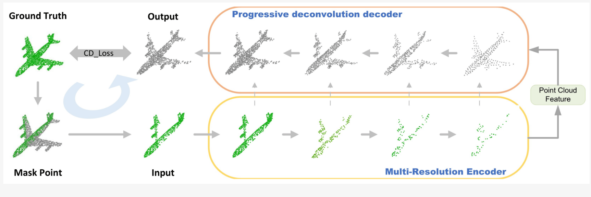
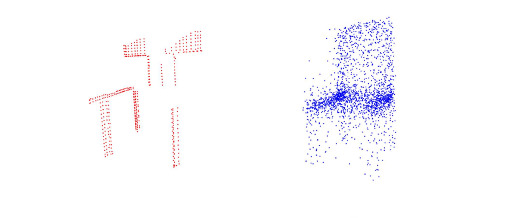
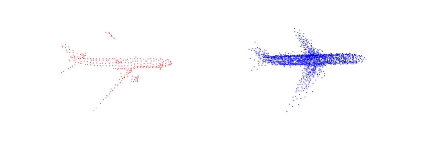
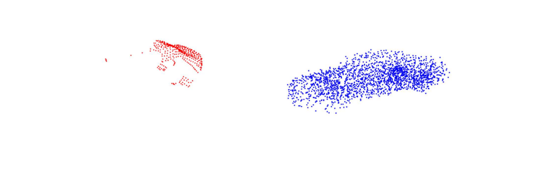

# Point_Cloud_Completion
This repository contains the implementation of a Point Cloud Completion algorithm using the PointNet architecture. The goal is to complete missing parts of 3D point clouds.
## Table of Contents

- [Introduction](#introduction)
- [Dataset](#dataset)
- [Model Architecture](#model-architecture)
- [Results](#results)
- [Team Members](#Team-Members)

# Introduction 
Point cloud completion is a crucial task in 3D computer vision and graphics, aimed at predicting and reconstructing missing parts of 3D point clouds. Point clouds are collections of data points in a 3D coordinate system, representing the external surface of objects or scenes. However, due to various limitations in data acquisition processes, these point clouds often contain incomplete or missing data. This project leverages the PointNet architecture to address this challenge by directly processing raw point cloud data to perform completion tasks. PointNet is renowned for its ability to handle unordered point sets and capture both local and global geometric features efficiently. By utilizing this architecture, our implementation seeks to enhance the accuracy and reliability of point cloud completion, providing a robust solution for applications in 3D modeling, computer-aided design (CAD), virtual reality (VR), and more.

# Dataset
We have downloaded the dataset from https://completion3d.stanford.edu/
which contains both partial point cloud and complete point cloud.

# Model Architecture
The point cloud completion model is designed to effectively process and reconstruct 3D point clouds using a combination of encoder and decoder networks. The architecture is inspired by the PointNet framework, which is well-suited for handling unordered point sets and capturing their geometric features.

PointNet Encoder 
The PointNetEncoder is responsible for extracting high-dimensional feature representations from the input point cloud. The encoder consists of three 1D convolutional layers followed by three fully connected layers:  
Conv1: Converts the 3-dimensional input points to 64 dimensions.  
Conv2: Expands the 64-dimensional features to 128 dimensions.  
Conv3: Further expands the 128-dimensional features to 1024 dimensions.  
Max Pooling: A global max pooling operation is applied to capture the most prominent features.  
FC1: A fully connected layer reducing the 1024-dimensional vector to 512 dimensions.  
FC2: Another fully connected layer further reducing the 512 dimensions to 256.  
FC3: The final fully connected layer brings the feature vector back to 1024 dimensions.  

PointCloud Decoder  
The PointCloudDecoder is tasked with reconstructing the complete point cloud from the high-dimensional features provided by the encoder. The decoder consists of three fully connected layers:  
FC1: Reduces the 1024-dimensional input to 256 dimensions.  
FC2: Expands the 256-dimensional vector to 512 dimensions.  
FC3: Converts the 512-dimensional features into the desired number of points, each having 3 coordinates (x, y, z).  
The output of the decoder is reshaped to match the original point cloud structure.  

Combined Model: PointCompletionNet  
The PointCompletionNet integrates the encoder and decoder to form a complete end-to-end model for point cloud completion. The model processes input point clouds through the encoder to extract features, and then through the decoder to reconstruct the missing parts of the point cloud. The architecture supports flexible input sizes, and the default number of output points is set to 2048.  

The combination of these networks allows the model to learn effective representations of point clouds and accurately predict missing regions, making it a robust solution for various 3D reconstruction tasks.

# Results

# Team Members

- [Aman Yadav](https://github.com/AmanYadav000)
- [Aman Tiwari](https://github.com/aman2603tiwari)
- [Aayush Rai](https://github.com/Whizamyhmer)

